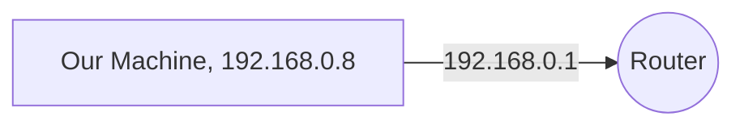
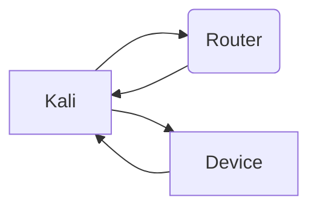

# ARP Poisoning and MiTM Attack
The objective of this project is to sniff a certain device traffic. 

**"Sniffing"** is the action of **intercepting another device's traffic (without the other user's acknowledgment) and capturing it for further analysis.** For this, I'll be using the technique known as ***ARP Poisoning*** (more info below). 

I'll use my home network for this example.  

## Step 0 | What do I need?
There are a variety of free tools available for Windows, Mac and Linux. For simplicity, in this example we will be using a Linux distribution with a variety of pen-testing software included, (but you can use any Linux distribution): 

 - Kali Linux 2022.3 
 - nMap 7.80
 - Ettercap 0.8.3

To install the required software, run:

    sudo apt get install nmap
    sudo apt get install ettercap-text-only
*We do not need the GUI for Ettercap*

## Step 1 | Where are we?
First we have to do some reconnaissance. We'll need the gateway IP:  
> ip r | grep default

 
So far our knowledge about the network is as follows:

By doing a scan of the network through nMap we can see other connected devices:

    nmap -sn gatewayIp/mask
     
In our case:

    nmap -sn 192.168.0.1/24

We are going to "substitute" the original 192.168.0.3 as a sender/reciever, and instruct the router to instead send all information through our Kali machine by abusing the Address Resolution Protocol. According to Radware: 

> The attack itself consists of an attacker sending a false ARP reply message to the default network gateway, informing it that his or her MAC address should be associated with his or her target's IP address (and vice-versa, so his or her target's MAC is now associated with the attacker's IP address). Once the default gateway has received this message and broadcasts its changes to all other devices on the network, all of the target's traffic to any other device on the network travels through the attacker's computer, allowing the attacker to inspect or modify it before forwarding it to its real destination.

This attack is known as MiTM. Notice how all communications between the Device and the Router passes through our Kali machine. 

## Step Two | ARP Poisoning 
During this process, we are going to trick the router into sending all communications to our machine with Ettercap. Briefly explained: 

 - Device 1 has a MAC address: **AA:BB:CC:DD:EE:FF**
 - Device 2 has a MAC address: **11:22:33:44:55:66**

Now we are going to abuse the Address Resolution Protocol to make the router think we are Device 1.  

 - Device 1 MAC Address: 11:22:33:44:55:66

To do this: 

    sudo ettercap -T -S -i [INTERFACE] -M arp:remote /[GATEWAY]// /[OBJECTIVE_IP]//
For this example:

    sudo ettercap -T -S -i eth0 -M arp:remote /192.168.0.1// /192.168.0.3//

What Ettercap is going to show us is the current connections and the information passing through our attacking machine (Note that this may cause a severe slowdown of the involved device)

## Step Three | Network Traffic Capture

Now we can run any protocol analyzer such as Wireshark to capture incoming/outgoing traffic.  (Just be sure to select the same interface defined in ettercap)

While Ettercap is running, open another terminal and run 

    sudo wireshark

Sniff away!

 

 
